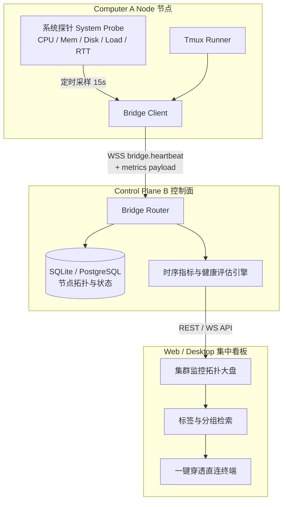
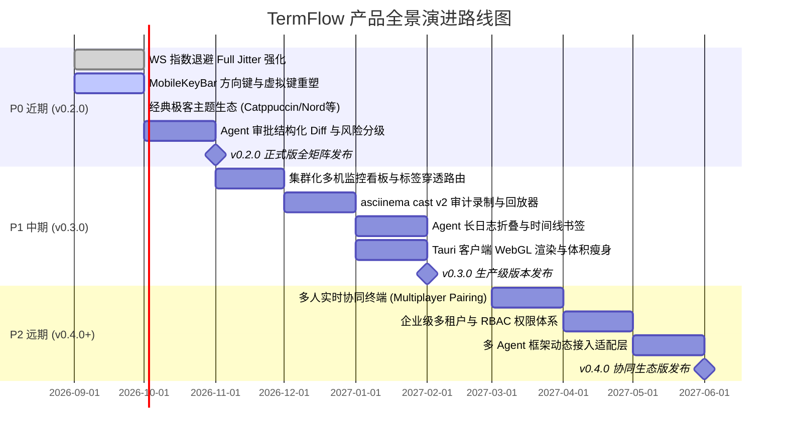

# TermFlow 产品深度调研与全景架构演进白皮书
> **TermFlow: The Resilient, Multi-Platform Web/Native Terminal & Agent Broker Platform**  
> 版本：v0.2.0 / 演进路线规划  
> 作者：TermFlow 系统架构与产品规划专家组  
> 日期：2026 年 9 月

---

## 目录 (Table of Contents)

- [1. 背景调查与行业趋势](#1-背景调查与行业趋势)
  - [1.1 远程开发与云原生运维的底层范式迁移](#11-远程开发与云原生运维的底层范式迁移)
  - [1.2 边缘设备与多云异构环境的反向穿透痛点](#12-边缘设备与多云异构环境的反向穿透痛点)
  - [1.3 移动办公与全天候应急响应的终端交互刚需](#13-移动办公与全天候应急响应的终端交互刚需)
  - [1.4 Agentic Coding 浪潮下的人机协同终端新范式](#14-agentic-coding-浪潮下的人机协同终端新范式)
- [2. 开源同类产品深度对比](#2-开源同类产品深度对比)
  - [2.1 主流开源/商业终端与访问代理横向对比矩阵](#21-主流开源商业终端与访问代理横向对比矩阵)
  - [2.2 现有产品核心缺陷与行业三大空白深度剖析](#22-现有产品核心缺陷与行业三大空白深度剖析)
- [3. 本产品定位与核心杀手级特点](#3-本产品定位与核心杀手级特点)
  - [3.1 总体产品定位](#31-总体产品定位)
  - [3.2 杀手级特点一：断网与重启下 tmux 会话绝对不丢失](#32-杀手级特点一断网与重启下-tmux-会话绝对不丢失)
  - [3.3 杀手级特点二：轻量级主动出网穿透与跨平台原生矩阵](#33-杀手级特点二轻量级主动出网穿透与跨平台原生矩阵)
  - [3.4 杀手级特点三：首创内置 Agent Broker 与人机在环审批流](#34-杀手级特点三首创内置-agent-broker-与人机在环审批流)
- [4. 目标用户画像与核心应用场景](#4-目标用户画像与核心应用场景)
  - [4.1 用户画像一：移动办公与全天候应急响应 SRE / 运维专家](#41-用户画像一移动办公与全天候应急响应-sre--运维专家)
  - [4.2 用户画像二：重度 CLI 极客与高性能工作站远程开发者](#42-用户画像二重度-cli-极客与高性能工作站远程开发者)
  - [4.3 用户画像三：自主 Agent 辅助编程与安全测试团队](#43-用户画像三自主-agent-辅助编程与安全测试团队)
  - [4.4 典型业务闭环工作流图解](#44-典型业务闭环工作流图解)
- [5. 当前代码与已实现功能深度盘点](#5-当前代码与已实现功能深度盘点)
  - [5.1 整体分层架构与进程边界拓扑](#51-整体分层架构与进程边界拓扑)
  - [5.2 各子模块代码实现与契约机制审查](#52-各子模块代码实现与契约机制审查)
  - [5.3 安全防线与凭据隔离体系审查](#53-安全防线与凭据隔离体系审查)
  - [5.4 工程质量与 CI/CD 自动化门禁现状](#54-工程质量与-cicd-自动化门禁现状)
- [6. 现有功能强化与架构加固方案](#6-现有功能强化与架构加固方案)
  - [6.1 WebSocket 优雅重连指数退避与 Full Jitter 防雪崩改造](#61-websocket-优雅重连指数退避与-full-jitter-防雪崩改造)
  - [6.2 断点事件补发、心跳防丢包与假死连接探测](#62-断点事件补发心跳防丢包与假死连接探测)
  - [6.3 内存背压、流量水线控制与崩溃隔离机制](#63-内存背压流量水线控制与崩溃隔离机制)
  - [6.4 Tauri 跨端客户端包体积瘦身与渲染性能调优](#64-tauri-跨端客户端包体积瘦身与渲染性能调优)
- [7. UI 与交互逻辑重塑（第一印象优化）](#7-ui-与交互逻辑重塑第一印象优化)
  - [7.1 现代化终端配色与经典极客主题生态扩展](#71-现代化终端配色与经典极客主题生态扩展)
  - [7.2 上下文感知型 tmux 状态栏与多标签/分屏快捷键浮层](#72-上下文感知型-tmux-状态栏与多标签分屏快捷键浮层)
  - [7.3 移动端虚拟辅助键盘 (MobileKeyBar) 全面增强](#73-移动端虚拟辅助键盘-mobilekeybar-全面增强)
  - [7.4 Agent 审批弹窗结构化 Diff 呈现与风险分级警告](#74-agent-审批弹窗结构化-diff-呈现与风险分级警告)
- [8. 缺失关键功能补充与痛点攻坚](#8-缺失关键功能补充与痛点攻坚)
  - [8.1 多机节点集群化集中监控大盘与一键穿透路由](#81-多机节点集群化集中监控大盘与一键穿透路由)
  - [8.2 命令执行审计历史与 asciinema 格式兼容录制回放](#82-命令执行审计历史与-asciinema-格式兼容录制回放)
  - [8.3 Agent 执行日志智能折叠、状态码统计与步骤书签](#83-agent-执行日志智能折叠状态码统计与步骤书签)
- [9. 未来分期演进计划 (P0 / P1 / P2)](#9-未来分期演进计划-p0--p1--p2)
  - [9.1 P0：近期 v0.2.0 稳定版收敛与体验打磨 (1~2 个月)](#91-p0近期-v020-稳定版收敛与体验打磨-12-个月)
  - [9.2 P1：中期 v0.3.0 生产化治理与可观测性跃升 (3~6 个月)](#92-p1中期-v030-生产化治理与可观测性跃升-36-个月)
  - [9.3 P2：远期 v0.4.0+ 团队协同与 Agent 生态外延 (6~12 个月)](#93-p2远期-v040-团队协同与-agent-生态外延-612-个月)
- [10. 核心总结与决策建议](#10-核心总结与决策建议)

---

## 1. 背景调查与行业趋势

### 1.1 远程开发与云原生运维的底层范式迁移

在过去十余年中，软件开发与基础设施运维经历了深刻的基础设施去本地化演进：
1. **本地环境的算力瓶颈与环境不一致（Configuration Drift）**：现代微服务架构、深度学习模型训练/微调、大型单体应用构建动辄需要几十个 CPU 核心、数百 GB 内存与专用 GPU 算力，本地开发机（轻薄办公本）已无法承载此类负载。
2. **云原生远程开发（Remote Development）成为标准实践**：以 GitHub Codespaces、Gitpod、Coder、DevContainer 为代表的远程容器化开发被广泛采纳。代码、构建环境与运行时均常驻在远端受控算力集群中，本地终端逐渐转变为“显示与交互的轻量入口”。
3. **运维工具链的 API 化与无侵入化要求**：生产与预发环境逐渐收紧网络边界，传统直接开放 SSH 22 端口给公网的模式已彻底被安全合规禁止，取而代之的是统一身份网关与反向长连接隧道技术。

### 1.2 边缘设备与多云异构环境的反向穿透痛点

在边缘计算、物联网网关、分布式私有云及高校/企业内网等场景中，计算节点广泛存在以下网络物理约束：
- **公网 IP 匮乏与多重 NAT/动态 IP**：节点处于运营商 CGNAT、4G/5G 移动蜂窝网络或企业严格出网策略之后，无法直接接受外部入站（Inbound）TCP 握手。
- **端口映射管理成本与安全暴露面剧增**：配置 DDNS、路由器 UPnP 或在公网防火墙打洞极易被网络空间测绘引擎（如 Shodan、Censys）捕获，暴露弱口令爆破、0-Day 漏洞利用攻击面。
- **主动反向长连接（Reverse Outbound Connection）成为破局标准**：计算节点以客户端身份，通过安全传输层（WSS / TLS）主动向拥有公网稳定地址的控制面（Control Plane）发起出站连接并长期保活，彻底免除目标机开放公网端口的需求。

### 1.3 移动办公与全天候应急响应的终端交互刚需

系统工程师（SRE）、DevOps 专家与技术负责人的应急排障常常发生在非工作场景（通勤地铁上、出差航班落地、咖啡馆或夜间休息）：
- **传统移动端 SSH 工具（如 Termius、Blink）的致命缺陷**：
  - **网络波动即断线**：地铁换乘、Wi-Fi 与蜂窝数据漫游切换时，底层 TCP 发生丢包或超时重传失败，SSH 会话断开，导致远端正在运行的长期任务（如数据库大表迁移、服务重启脚本、Docker 镜像构建）因接收到 `SIGHUP` 信号而异常中断，造成生产灾难。
  - **手机锁屏杀后台**：iOS 与 Android 系统的激进功耗策略会在应用切后台或锁屏后秒级挂起/杀死网络 Socket，恢复前台后终端失去响应。
  - **触屏交互反人类**：移动设备缺少物理键盘上的关键修饰键（`Ctrl`, `Alt`, `Esc`, `Tab`）及方向键，输入复杂 shell 组合键与 vim 操作极其痛苦。

### 1.4 Agentic Coding 浪潮下的人机协同终端新范式

自 2024-2025 年起，AI 编程工具正经历从单纯的代码补全（Copilot）向具备环境感知与自主执行闭环的 **Agentic Coding（如 OpenCode, Claude Code, Antigravity, Devin）** 的颠覆性变革：
- **执行实体进驻终端**：AI 不再只是提供建议，而是能够自主调用终端、执行编译器/解释器、运行单元测试、解析错误输出并自主修改文件。
- **传统终端工具在 Agent 交互中的时代缺陷**：
  - **无结构化语义管道**：传统终端只是无状态的 PTY 字符流，人类与 Agent 混在一个管道操作会产生致命输入冲突与屏幕混乱；Agent 缺少对其执行指令的边界管控与上下文感知。
  - **高危破坏性行为缺乏防护安全网**：自主 Agent 具备误删数据（如 `rm -rf`）、覆盖敏感配置文件、向生产环境推送错误分支的巨大合规与安全风险。
  - **执行过程缺乏透明度与可回放性**：无法直观审查 Agent 做了哪些推理（Thinking block）、调用了什么工具、修改了哪些具体行。
- **全新范式：人机共生终端与智能中继（Human-in-the-Loop Agent Broker）**：
  终端不仅要为人类工程师提供安全、抗网络闪断的 PTY 渲染，更需要将自身封装为面向 Agent 的标准执行靶机；在执行高危命令前触发强身份校验的**人工审批门禁（Approval Gate）**，实现“只读命令自主执行，破坏操作人机把关，事件流实时投影回放”。

---

## 2. 开源同类产品深度对比

### 2.1 主流开源/商业终端与访问代理横向对比矩阵

| 评估维度 | **TermFlow (本产品)** | **ttyd** | **Apache Guacamole** | **Teleport** | **Cloudflare Tunnels** | **Warp Terminal** | **WebSSH (如 Sshwifty)** |
| :--- | :--- | :--- | :--- | :--- | :--- | :--- | :--- |
| **开源协议** | MIT 宽松开源 | MIT | Apache 2.0 | AGPLv3 / 商业闭源 | 商业托管 (端开源) | 专有商业闭源 | MIT / GPL |
| **核心定位** | 云原生轻量级反向穿透 + 深度 tmux 保活 + Agent 协同控制面 | 单机 Web 终端包装器 | 传统多协议 (RDP/VNC/SSH) 网页堡垒机 | 企业级零信任基础设施访问与合规网关 | 边缘 L4/L7 反向代理隧道服务 | 现代 AI 原生桌面客户端终端 | 单机/简单 Web 到 SSH 代理转换器 |
| **会话保活机制** | **原生 tmux control-mode 深度绑定，断网/重启会话绝对不丢** | 依赖裸 PTY，若未手动挂载 tmux，断网直接进程崩溃 | 维持远端 SSH 连接，若网络重置则会话中断 | 断网断开 SSH Channel，需手动重连远端 session | 仅网络层穿透，不具备会话状态与生命周期保活 | 依赖本地进程或标准 SSH，断网仍受传统通道约束 | 依赖服务器内存维持 SSH 客户端，网络超时即断 |
| **控制面与穿透拓扑** | **轻量级单容器/多节点主动 WSS 穿透，无需目标机开放公网端口** | 无控制面，目标机必须监听本地/公网端口，无内建穿透 | 重型 Java/C 架构网关，通常需在内网部署并开接入端口 | 重型集群架构 (Auth/Proxy/Node)，部署复杂度高 | 依托全球 Anycast 边缘，仅提供通道无终端管理 | 无独立服务端控制面，依赖个人登录云端账号 | 无集中控制面或极轻量单机代理，无拓扑感知 |
| **多客户端矩阵** | **Web SPA + Tauri v2 原生桌面 (Linux/Mac/Win) + 移动端 (Android/iOS)** | 仅支持 Web 浏览器 | 仅支持 Web 浏览器 | Web UI + `tsh` 命令行客户端 | 无终端专用客户端 (仅 Web 控制台) | 仅支持 macOS / Linux 桌面原生客户端 | 仅支持 Web 浏览器 |
| **移动端触控优化** | **内建专属 MobileKeyBar (Ctrl/Alt/Esc/Tab/Prefix/方向键)，视口缩放与平移** | 仅基础键盘弹出，移动端修饰键缺失，体验极差 | 虚拟鼠标模式为主，触屏字符输入极度别扭 | 移动端无官方优秀原生终端适配 | 无移动终端 UI | 无原生移动端支持 | 部分支持简单快捷按键，缺少手势视口控制 |
| **AI Agent 协同** | **首创内建 Agent Broker，支持 OpenCode 原生接入与 MCP 协议人机审批流** | 无任何 AI/Agent 能力 | 无任何 AI/Agent 能力 | 无 Agent 语义层与审批流（仅传统会话双人审批） | 无 Agent 终端协同机制 | 客户端级 AI 问答/自动补全，非中继靶机模式 | 无任何 AI/Agent 能力 |
| **安全与权限体系** | **TOTP 保护、OAuth 2.0 PKCE + DPoP、CLI 短期 Token、Fresh Re-auth** | 仅支持明文 Basic Auth，安全边界极薄弱 | 关系型数据库 RBAC、LDAP/Duo 插件集成 | 企业级 CA 证书、SSO/OIDC、精确细粒度 RBAC | Cloudflare Access 零信任身份集成 | 依赖商业账号体系与云端授权 | 仅简单密码或独立配置文件，无现代令牌体系 |

### 2.2 现有产品核心缺陷与行业三大空白深度剖析

#### 空白一：断网会话无缝保活断层（tmux 深度原生绑定）
现有方案在处理“网络断开”这一物理现实时存在严重割裂：
- **ttyd / WebSSH 类工具**：底层通常直接 `forkpty()` 启动 shell。当浏览器刷新、客户端掉线或 WebSocket 握手断开时，内核检测到连接终止向子进程发送 `SIGHUP` 信号，正在执行的长任务直接灰飞烟灭。即便用户在里面运行 `tmux`，也只是作为终端内部的黑盒字符显示，Web 终端无法获知 tmux 内部的 Window、Pane 拓扑，无法根据本地屏幕动态协调终端权威行列号（Rows/Cols）。
- **Guacamole / Teleport**：将自己定位为标准 SSH 客户端。一旦网络波动导致底层 SSH TCP 连接断开，远端即便有 `screen` 或 `tmux`，用户重连后也必须重新登录、重新执行 `tmux attach`，原有的终端视口、选中高亮、控制模式完全断裂。
- **TermFlow 的代际突破**：TermFlow 首次将 **tmux control-mode 作为一等公民（First-class Citizen）**。每个 Term 独占一个私有 tmux socket 与守护 Bridge 进程。Control Plane 与前端消费的是 tmux 结构化拓扑与 PTY 字节流，终端大小由 Node 权威协商，网络断线甚至 Control Plane 升级重启，Node 上的任务不仅继续执行，重连后还能凭借单调自增序号（`seq`）与内存环缓冲实现**毫秒级无感热附着**。

#### 空白二：多端轻量反向穿透与控制面断层
- 传统穿透工具（如 FRP、NPS、Cloudflare Tunnels）只管“网络管道搭建”，不管“终端生命周期”。用户需要自行拼装反向代理、配置 Nginx、安装 ttyd、编写守护脚本，运维极其繁杂脆弱。
- 企业级堡垒机（如 Teleport）功能完备，但体系庞大冗杂，依赖复杂的 CA 证书分发体系与高资源消耗，个人开发者与轻量化团队部署使用心智负担极高。
- **TermFlow 的代际突破**：提供极致轻量的拓扑。Control Plane 为单容器部署，Node 端为无需 root 权限的轻量 Python 进程或开箱即用的 Docker 容器。通过一次性注册码（Enrollment Token）秒级入网，彻底解决“内网穿透 + 认证中枢 + 终端管理”的全链路闭环。

#### 空白三：Agent Broker 人机协同执行的时代空白
- 当前市面上的“AI 终端”（如 Warp）本质上是“具有 AI 生成能力的个人前端”：它将 LLM 生成的命令粘贴进用户的输入框，依然完全依赖人类单一视角的输入与确认。它无法作为后台执行靶机被外部智能体调度，无法对接企业/组织自建的自主 Agent。
- 开源 Agent 项目（如 AutoGPT、OpenCode）直接运行在宿主机上，通过粗暴的 Shell 执行工具调用系统命令，缺乏可视化监控视口，一旦失控会造成难以挽回的破坏。
- **TermFlow 的代际突破**：成为全球首个将 **Terminal Platform 与 Agent Broker 深度咬合** 的产品。它不仅是一个供人类使用的远程终端，更对外暴露标准的 MCP Server 接口；AI Agent 可以将 TermFlow 作为带沙盒边界的目标机，通过结构化协议进行代码测试与构建；而人类工程师可以通过并排的侧边栏（Sidecar Panel）实时监视 Agent 思考、输出，并在关键写操作时行使一票否决权（Human-in-the-Loop）。

---

## 3. 本产品定位与核心杀手级特点

### 3.1 总体产品定位

```text
┌─────────────────────────────────────────────────────────────────────────────┐
│                             TermFlow 产品定位                                │
│                                                                             │
│   面向云原生时代与 Agentic AI 协同的下一代轻量化弹性远程终端与人机协作控制面平台   │
└─────────────────────────────────────────────────────────────────────────────┘
```

TermFlow 既是**系统工程师手中的全天候移动应急终极利器**，也是**连接自主编程 Agent 与真实计算环境的安全受控枢纽**。

### 3.2 杀手级特点一：断网与重启下 tmux 会话绝对不丢失

- **Node 独占式架构**：每个 Term 在 Computer A 上拥有独立的 UUID、隔离的持久化状态目录（`XDG_STATE_HOME`）、独立的私有 tmux socket 以及专职的 Bridge 进程。
- **免受任何外界干扰**：
  - 客户端浏览器刷新、切标签页、断网关闭，甚至杀掉原生 App，A 端命令照常运行；
  - 控制面（Control Plane B）遭遇容器重启、服务滚动升级，A 端的 Bridge 会自动进入指数退避重连，恢复后拓扑与状态立即重同步；
  - A 端本地开发者直接在本地终端退出 CLI 或在本地 detach tmux，均绝不影响远端 Bridge 与后台任务的稳定驻留。
- **权威尺寸与自适应视口分离**：A 拥有终端尺寸（Rows/Cols）的唯一权威裁决权（优先本地 tmux client 真实尺寸，次选远端最后观测值，兜底 80×24）。客户端视口的缩放（50%、75%、100%、Fit to Window）纯粹作为渲染层视口平移，绝不破坏远端 tmux 的字符布局。

### 3.3 杀手级特点二：轻量级主动出网穿透与跨平台原生矩阵

- **纯主动出站连接模型（Pure Outbound WSS）**：Computer A 仅以普通客户端身份向 Control Plane B 建立单一 WebSocket 长连接。无论是家中的 NAS、内网 GPU 服务器还是云端 ECS，无需分配公网 IP，无需配置端口映射，天然穿越任何 NAT 与严苛防火墙。
- **现代化跨端体验一致性**：
  - **Web 端**：基于 Vue 3 + Vite + xterm.js 构建的极简 SPA，零配置开箱即用；
  - **原生桌面端**：基于 Tauri v2 + Rust 构建，覆盖 Linux (deb/AppImage)、macOS (dmg/app)、Windows (msi/exe)，占用内存与二进制体积相较于 Electron 降低 80% 以上；
  - **移动端**：原生适配 Android APK/AAB 与 iOS Simulator，配备专门优化的移动端触控手势、虚拟辅助按键栏（MobileKeyBar），真正实现手机运维自由。

### 3.4 杀手级特点三：首创内置 Agent Broker 与人机在环审批流

- **OpenCode 与标准 MCP 原生集成**：Control Plane 内置 Agent Broker 模块，作为中立安全中介（Broker），向下游暴露标准 MCP 接口，原生对接 OpenCode 等自主编码智能体。
- **细粒度权限控制与审批安全网（HITL Gate）**：
  - **只读操作自动执行**：查询环境、读取文件、列出进程等操作自动通过；
  - **高危写入操作强制拦截**：执行修改文件、运行潜在危险脚本等写工具时，触发审批挂起状态；
  - **强身份认证上下文（Fresh Authentication Context）**：管理员必须在 5 分钟内完成过强身份验证（口令 + TOTP），方有权限批准高危动作，彻底杜绝跨站脚本与会话冒用劫持。
- **实时 AG-UI 协议事件流投影**：前端具备优雅的 Sidecar 并排侧边栏，Agent 的 Prompt 输入、思考链（Thinking Process）、工具调用参数与终端 PTY 输出双向实时同步。

---

## 4. 目标用户画像与核心应用场景

### 4.1 用户画像一：移动办公与全天候应急响应 SRE / 运维专家

- **人物特征**：30-45 岁，中高级运维、SRE、平台工程负责人，管理数十至数千台服务器，承担 7x24 小时生产可用性兜底职责。
- **核心痛点**：
  - 在地铁通勤、节假日出游、夜间休息时突然收到 P1 级系统告警；
  - 掏出手机使用传统 SSH 连接常常因为信号切换而频繁断连重连；
  - 缺少物理键盘，用手机自带输入法无法精准敲出 `Ctrl+C`、`Tab` 补全或执行 `top` 退出。
- **TermFlow 带来的价值**：
  - 手机浏览器或 Android/iOS 客户端一键开机秒连；
  - 借助 MobileKeyBar 专用虚拟按键，一键输入 `Prefix`、`Esc`、`Tab`、`Ctrl+C`，单手完成故障排查；
  - 即便进电梯断网，出电梯后自动重连恢复现场，不丢字符，正在执行的排障脚本未受任何影响。

### 4.2 用户画像二：重度 CLI 极客与高性能工作站远程开发者

- **人物特征**：资深后端工程师、系统程序员、算法研究员，高度依赖 Vim/Neovim、tmux、Zsh 等命令行工具链进行全天候开发。
- **核心痛点**：
  - 本地轻薄本续航好但无 GPU，远程台式机/服务器算力强但置于公司内网；
  - 使用 VS Code Remote 等重量级远程连接常因网络轻微丢包而卡死甚至消耗海量内存；
  - 普通 Web 终端无法精准识别 tmux 的复制模式、多 Window 切换与复杂按键绑定。
- **TermFlow 带来的价值**：
  - 极致轻量：客户端内存占用不到 100MB，字符渲染延迟低于 20ms；
  - 完美的 tmux 原生兼容：TermFlow 在底层直接对接 tmux control mode，快捷键、状态栏、分屏高亮百分之百还原原生开发体验；
  - 支持全平台客户端，随时随地保持统一的编码环境。

### 4.3 用户画像三：自主 Agent 辅助编程与安全测试团队

- **人物特征**：AI 研发团队、自动化安全渗透测试工程师、探索 Agentic 落地的前沿开发者。
- **核心痛点**：
  - 想要让 Agent 自主执行复杂的多步构建、调试与验证任务，但不敢给予 Agent 裸 root 权限或不受约束的终端；
  - 缺乏统一的可观测界面，无法直观确认 Agent 当前在哪个窗口、执行了什么命令、改了什么代码；
  - 发生异常或偏离意图时无法迅速人为干预截断。
- **TermFlow 带来的价值**：
  - TermFlow 作为受管靶机宿主，Agent 所有执行动作必须经由 MCP 协议报备；
  - 独创 Sidecar 人机同台交互：工程师左侧看着真实代码编译与服务运行，右侧与 Agent 实时对话引导其思路；
  - 涉及高危写盘与环境修改时，弹出结构化审批请求，人类严格把关后再放行。

### 4.4 典型业务闭环工作流图解

```mermaid
sequenceDiagram
    autonumber
    actor Admin as 运维/研发工程师 (Web/Mobile/Desktop)
    participant CP as Control Plane B (FastAPI + Agent Broker)
    participant Node as Computer A (tmux Bridge + PTY)
    participant Agent as OpenCode / LLM Agent Runtime

    Note over Admin,Node: 阶段一：高可靠终端运维与会话保活
    Node->>CP: 主动出网 WSS 建立长连接 (bridge.hello / heartbeat)
    Admin->>CP: 登录认证 (OAuth PKCE / TOTP)，打开目标 Term
    CP->>Node: terminal.open 请求打开真实 tmux client
    Node-->>CP: terminal.opened (返回 stream_id, 权威 rows/cols, 绑定快照)
    CP-->>Admin: 终端 WebSocket 就绪 (二进制 PTY 流双向畅通)
    Note over Admin,Node: 遇到突发断网或移动端切后台 (TCP 闪断)
    Admin-xCP: 客户端断网掉线
    Node->>Node: 任务持续在 tmux 独立会话运行，输出暂存本地环形缓冲
    Admin->>CP: 网络恢复，带上次 seq/stream_id 快速重连
    CP->>Node: 发送 replay 增量请求
    Node-->>CP-->>Admin: 毫秒级补发丢失字符，全量画面无缝恢复

    Note over Admin,Agent: 阶段二：Agentic 协同执行与人机把关审批
    Admin->>CP: 开启并激活当前 Term 的 Agent 协同 (TerminalAgentToggle)
    Admin->>CP: 发送自然语言开发需求: "修复构建失败并执行单元测试"
    CP->>Agent: 派发 Prompt (带 Pane 拓扑上下文)
    Agent->>CP: 思考后发起只读 MCP 工具调用: bash(cat Makefile)
    CP->>Node: 自动执行并在指定 Pane 输入命令
    Node-->>CP-->>Agent: 捕获输出并返回上下文
    Agent->>CP: 发起高危写操作: bash(rm -rf build/ && git checkout .)
    CP->>CP: 策略拦截！进入 PENDING 审批状态，生成 Canonical Hash
    CP-->>Admin: 侧边栏/弹窗推送结构化审批卡片 (高危警告 + 意图摘要)
    Admin->>CP: 校验修改内容，提交确认批准 (Fresh Auth 校验)
    CP->>Node: 注入执行高危写入动作
    Node-->>CP-->>Agent: 命令执行结果与退出状态码
    CP-->>Admin: 实时事件流与终端输出同步呈现完成
```

---

## 5. 当前代码与已实现功能深度盘点

### 5.1 整体分层架构与进程边界拓扑

TermFlow 当前代码库采用了清晰的 Monorepo 现代化工程架构，严格遵循**关注点分离与进程边界隔离**原则：

```text
/home/mcocdaa/AI_CODE/TermFlow/
├── packages/
│   ├── protocol/          # Pydantic 2 版本化强类型消息协议与数据模型
│   ├── client-contracts/  # 自动生成的 TypeScript 契约与类型定义
│   ├── client-core/       # 框架无关的客户端核心库 (Auth/Session/AgentStream/HTTP)
│   ├── client-ui/         # Vue 3 核心交互与业务视图组件库
│   └── design-tokens/     # 统一设计系统与主题 CSS 变量定义
├── apps/
│   ├── control-plane/     # FastAPI + SQLAlchemy 异步控制面与 Agent Broker 服务
│   ├── node/              # Python 3.12+ 守护进程 (tmux 运行器、PTY、Bridge Transport)
│   └── clients/
│       ├── web/           # Vite 驱动的纯前端 Web SPA
│       └── tauri/         # Tauri v2 (Rust + Vue 3) 跨端桌面与移动端工程
└── deploy/                # Dockerfile 与 Docker Compose 生产编排与安全基线
```

### 5.2 各子模块代码实现与契约机制审查

#### 1. 协议契约层 (`packages/protocol` & `packages/client-contracts`)
- **严格版本化 Envelope**：所有 Bridge 与 Control Plane 交互强制封装于 `WireMessage(protocol_version=1)` 中。
- **强类型 Pydantic 2 校验**：输入文本强制经过 `validate_plain_text()` 校验，严格限制最大 16 KiB 并剔除破坏性 C0/C1 控制字符；原始终端字符流强制使用严格 Base64 编码，单帧不得超过 65,536 字节。
- **单向生成保障前后端一致性**：通过 `scripts/generate-client-contracts/generate.py` 将 Python 数据契约自动生成为 TypeScript 类型（`generated.ts`），CI 强制执行 `contracts:check` 阻断类型漂移。

#### 2. 客户端核心状态机 (`packages/client-core`)
- **`TerminalSession`**：封装底层 WebSocket 通信，实现 `connecting -> connected -> reconnecting -> closed` 完整四态机；管理终端尺寸协商与二进制 PTY 流分帧传输。
- **`AgentStreamSession`**：封装 AG-UI 协议事件投影，基于游标（Cursor）与事件唯一 ID 机制支持冷启动状态还原与断网重放（Replay），确保在长连接重建时 Agent 消息不重不漏。
- **`MobileModifierController`**：针对移动端修饰键（`Ctrl`, `Alt`, `Shift`）提供 `off / on / sticky`（单次有效 / 锁定状态）三态切换控制器。

#### 3. 前端交互界面 (`packages/client-ui`)
- **`TerminalCanvas.vue`**：封装 `@xterm/xterm`，实现精确的终端单元格像素测量（`measureCell`）与自适应视口平移缩放（`usePointerViewport`），完美支持触控双指缩放。
- **`TerminalAgentPanel.vue` & `AgentChatSession.vue`**：提供侧边栏并排会话抽屉，嵌入对话历史列表、思考块折叠（`AgentThinkingBlock.vue`）、工具调用状态机（`AgentToolActivity.vue`）与审批卡片。
- **`AgentApprovalPanel.vue`**：支持待审批任务列表展示、倒计时失效检测与一键批准/拒绝/撤销。

#### 4. 控制面核心服务 (`apps/control-plane`)
- **`BridgeConnectionRouter`**：管理所有 Computer A 的反向 WSS 连接，维护内存级在线拓扑快照。
- **`TerminalHub`**：实现客户端与 Node 之间的无状态、高吞吐 PTY 流双向转发，内建字节与消息数量双重队列限制，遇到背压时执行安全熔断。
- **`plugins/agent_broker`**：
  - **`OpenCodeAdapter`**：通过 SSE 订阅 OpenCode 运行时事件，并将模型交互转换为标准 AG-UI 协议；
  - **`McpServer`**：暴露受管的只读与写入终端工具集合；
  - **`AgentCommandService`**：实现对命令意图的结构化哈希签名（Canonical Hash）与审批流阻断。

#### 5. 节点驻留服务 (`apps/node`)
- **独立进程守护**：`termflow_node` 采用异步多任务框架，每个 Term 启动专属 Bridge 任务。
- **`tmux` 深度控制**：使用 `tmux -CC`（Control Mode）实时监听 `%window-add`, `%pane-mode-changed`, `%output` 事件，保证绝对精准的拓扑感知。
- **`OutputRingBuffer`**：每个 Pane 独占带有 `stream_id` 与自增序列号的内存环形缓冲，并在发生丢包或背压时发出 `stream.gap` 信号，倒逼客户端重绘全量屏幕。

### 5.3 安全防线与凭据隔离体系审查

当前系统构建了坚不可摧的安全防御体系（Zero-Trust by Design）：
1. **凭证分层与最小特权原则**：
   - 浏览器端使用 `HttpOnly; SameSite=Strict` Cookie，杜绝 XSS 凭证窃取；
   - 原生客户端使用 OAuth 2.0 PKCE 配合 **DPoP (Demonstrating Proof-of-Possession)** 绑定硬件私钥，防止 Token 窃听与重放；
   - Node 端仅持有单用途的 `Instance Credential`，绝无越权访问其他 Term 或读取系统数据库的可能。
2. **两步验证与主密钥轮换（TOTP Security）**：
   - 支持标准的 RFC 6238 TOTP 动态口令双因素保护；
   - 数据库中保存的 TOTP 密钥均经过独立文件主密钥（`totp-master-key`）AES-GCM 加密，且支持自动化平滑重加密轮换。
3. **敏感操作新鲜度拦截（Fresh Auth Gate）**：
   - 涉及审批高危写入、激活 Agent 绑定、接受模型条款的操作，必须通过 300 秒内的强认证凭据（`AdminAuthContext`）；
   - 拒绝使用过期的无密码 Bearer Token 直接执行破坏性指令。
4. **运行时出网边界沙盒化（Egress Confinement）**：
   - 在 Compose 编排中，Control Plane 与 OpenCode 运行在隔离的 `agent_internal` 桥接网络中；
   - Agent 模型出网访问通过专用的白名单代理容器强制受限转发，禁止 Agent 容器未经授权探测外部私有局域网。

### 5.4 工程质量与 CI/CD 自动化门禁现状

项目展现出了卓越的工业级工程素养与代码卫生规范：
- **静态质量门禁**：`ruff`（包含 E, F, I, UP, B, ASYNC 规则集）、`mypy --strict` 全静态类型覆盖无一放过。
- **测试覆盖矩阵**：
  - Python 侧：`packages/protocol` (141 tests 全部通过)、`apps/node` (110 tests 全部通过)、`apps/control-plane` (671 tests 完整覆盖，涵盖复杂的审批、令牌刷新、重放和状态迁移)；
  - TypeScript 侧：Vitest (56 个测试套件，204 个用例 100% 通过)；
  - 自动化契约检测：生成代码校验 `npm run contracts:check` 阻断非同步修改。
- **流水线覆盖度**：GitHub Actions 全量覆盖 Linux x86_64、Windows、macOS 桌面编译，以及 Android AArch64 APK 与 iOS Simulator 容器化构建。

---

## 6. 现有功能强化与架构加固方案

尽管当前代码库基础极其扎实，但基于最高标准的系统级性能与极限可靠性要求，仍可在以下核心物理链路进行针对性架构加固：

### 6.1 WebSocket 优雅重连指数退避与 Full Jitter 防雪崩改造

#### 【现存隐患排查】
在深入代码审查中发现：
- 节点端 `apps/node/src/termflow_node/bridge/backoff.py` 正确实现了带随机抖动（Full Jitter）的退避算法；
- 但在前端核心库中：
  - `packages/client-core/src/terminal/session.ts`（第 172 行）：
    ```typescript
    const delay = Math.min(10_000, this.reconnectDelayMs * 2 ** this.reconnectAttempt)
    ```
  - `packages/client-core/src/agent/stream.ts`（第 374 行）：
    ```typescript
    const delay = Math.min(MAX_RECONNECT_DELAY_MS, this.reconnectDelayMs * 2 ** this.reconnectAttempt)
    ```
  两处均为**完全确定性的纯倍增退避**，未加入随机抖动！

#### 【加固实施方案】
当集群发生网络抖动或服务端微重启时，所有并发连接的浏览器客户端和原生客户端将在同一毫秒级时间窗内发起重连，形成破坏性的**惊群效应（Thundering Herd Problem）**与重连雪崩。

必须统一改造为 **Decorrelated Full Jitter** 算法：

```typescript
// 建议在 @termflow/client-core 中抽象公用 Backoff 计算函数
export function calculateJitterDelay(
  attempt: number,
  baseDelayMs: number = 1_000,
  maxDelayMs: number = 10_000,
  randomFn: () => number = Math.random
): number {
  const ceiling = Math.min(maxDelayMs, baseDelayMs * (2 ** attempt))
  // Full Jitter: 在 0 到当前上限之间均匀随机
  return Math.floor(randomFn() * ceiling)
}
```

并在 `TerminalSession` 与 `AgentStreamSession` 中统一切换为此算法，彻底瓦解重连波峰。

### 6.2 断点事件补发、心跳防丢包与假死连接探测

#### 【现存隐患排查】
- 移动网络和家用宽带中的 NAT 网关（如路由器、移动基站中继）通常对空闲 TCP 连接设置了 30~60 秒的极短保持时间。
- 如果用户正在阅读输出长篇文本且未敲击键盘，连接将无任何物理数据流动；此时中间网关可能静默丢弃映射表项，导致连接进入“假死状态（Zombie Connection）”——前端没有收到 TCP FIN/RST，仍显示 `connected`，但按键输入无法送达。

#### 【加固实施方案】
1. **全双工双向心跳检测（Bidirectional Ping/Pong Frame）**：
   - 协议层增加专用轻量心跳指令：`{"type": "terminal.ping", "timestamp": ...}`；
   - 客户端每隔 15 秒主动向服务端发送 `ping`，若超过 2 个周期（30 秒）未收到服务端的 `pong` 响应，主动认定连接假死，强制调用 `transport.close()` 并立即唤起无感重连。
2. **断点增量补发协商（Offset-based Fast Re-sync）**：
   - 客户端在重连握手报文中显式携带 `last_received_seq`；
   - 服务端优先从内存环中检索差额数据直接推回，避免每次断连都强制拉取全量屏幕快照重绘（Screen Redraw），大幅降低移动弱网下的流量开销。

### 6.3 内存背压、流量水线控制与崩溃隔离机制

#### 【现存隐患排查】
- 在 `apps/control-plane/src/termflow_control_plane/connections/terminal_hub.py` 中：
  当队列超出 `queue_max_bytes` 时，当前策略是直接调用 `terminate("internal_error", error_code="backpressure")` 强行终止终端连接。
- 若某个后台任务执行了 `cat /dev/urandom` 或一次性打印几百兆日志，这种直接粗暴断连会导致用户终端闪退。

#### 【加固实施方案】
1. **基于高低水位的两阶段流控（Two-stage Watermark Throttling）**：
   - 引入高水位（High Watermark，如 80% 缓冲）：触发 Node 端 PTY 读取降速（Pause Node PTY read），通过底层 TCP 反压抑制生产端生成速率；
   - 降至低水位（Low Watermark，如 30% 缓冲）：重新恢复 Node 端 PTY 读取；
   - 只有在极罕见连续堵塞超过 15 秒时才考虑熔断，最大化保障极端字符洪峰下的连接韧性。

### 6.4 Tauri 跨端客户端包体积瘦身与渲染性能调优

#### 【优化实施方案】
1. **Rust 二进制极限体积压缩**：
   - 在 `src-tauri/Cargo.toml` 的 `[profile.release]` 中启用极限优化：
     ```toml
     [profile.release]
     opt-level = "z"        # 针对体积极限优化
     lto = true             # 开启跨 Crate 链接时优化 (LTO)
     codegen-units = 1      # 提升优化深度
     panic = "abort"        # 裁剪 stack unwinding 冗余代码
     strip = true           # 自动剥离符号表
     ```
2. **xterm.js WebGL 与 Canvas 渲染加速按需激活**：
   - 在桌面端（Windows/Linux/macOS）安装 `@xterm/addon-webgl`，充分利用桌面独立 GPU 加速终端字符位图绘制，将 120Hz 高刷屏下的渲染延迟从 16ms 压降至 2ms 以内；
   - 在移动端（Android/iOS）智能回退到标准 Canvas 模式，避免移动端 WebGL 长期持有 GPU 上下文带来的电池过热与功耗流失。
3. **移动端视口动态 ResizeObserver 与触控惯性优化**：
   - 针对手机软键盘弹起时导致视口高度骤降的常见 Bug，使用 CSS `interactive-widget=resizes-content` 配合动态视口补偿，确保输入法弹出时始终锚定在终端最后活动行。

---

## 7. UI 与交互逻辑重塑（第一印象优化）

一个现代化的系统工具，其**第一印象（First Impression）**往往决定了用户的采纳率与信任度。终端不应是冰冷刺眼的黑底白字，而应具备精雕细琢的工匠质感。

### 7.1 现代化终端配色与经典极客主题生态扩展

#### 【现状与痛点】
目前 `@termflow/design-tokens` 仅内建了 `midnight-indigo`、`graphite-signal` 和 `cloud-cobalt` 3 款基础主题，无法满足追求个性化与长时间编码舒适度的终端极客群体。

#### 【重塑方案】
在 `packages/design-tokens/src/themes/` 中引入社区公认最高人气的 5 大经典极客主题族群：
1. **Catppuccin (Mocha / Latte)**：柔和且具有极高辨识度的粉彩复古风，深浅两色俱全；
2. **Tokyo Night**：深蓝黑底色与霓虹高对比度语法高亮，夜间沉浸感第一选择；
3. **Nord**：以北极冰雪为灵感的清冷克制色调，极佳的视觉疲劳缓解能力；
4. **Dracula Official**：高对比度的吸血鬼紫暗色经典，黑客范十足；
5. **Solarized (Dark / Light)**：科学设计的色度分布，兼具日间强光与暗光环境下的字符清晰度。

在终端右上角标题栏增加**一键主题切换抽屉**，并支持与宿主系统 `prefers-color-scheme` 动态跟随自动切换。

### 7.2 上下文感知型 tmux 状态栏与多标签/分屏快捷键浮层

#### 【现状与痛点】
许多初学者和非重度用户高度渴望 tmux 的会话持久性，但往往被其生涩的组合快捷键劝退（例如：分屏是 `Ctrl+B %` 还是 `"`？切换面板怎么按？怎么放大当前窗格？）。

#### 【重塑方案】
在终端顶部导航或悬浮底部设计**上下文感知的极客辅助卡片（Cheatsheet Floating Bar）**：
- **动态前缀键显示**：根据 Node 上报的 `bindings.prefix`，自适应高亮当前实际前缀（如 `Prefix: Ctrl+B`）；
- **可视化一键语义动作按钮组**：
  - `左右分屏`（`Ctrl+B %` / `split_left_right`）
  - `上下分屏`（`Ctrl+B "` / `split_top_bottom`）
  - `全屏缩放`（`Ctrl+B z` / `toggle_zoom`）
  - `新建窗口`（`Ctrl+B c` / `new_window`）
  - `复制模式`（`Ctrl+B [` / `copy_mode`）
- 点击按钮直接触发 `terminal.action` 语义调度，无需敲击物理按键；既作为快捷入口，又作为交互提示，极大降低新手入门门槛。

### 7.3 移动端虚拟辅助键盘 (MobileKeyBar) 全面增强

#### 【现状与痛点】
审查 `packages/client-ui/src/components/terminal/MobileKeyBar.vue` 源码：
目前仅有按键：`Ctrl`, `Alt`, `Shift`, `Esc`, `Tab`, `Prefix`。
**完全缺失移动端运维最核心的按键**：
- **缺少方向键（↑ / ↓ / ← / →）**：在手机上根本无法调取历史执行命令（上箭头），无法在 `vim` 中移动光标，无法在 `htop` 中切换选中进程！
- **缺少快速中断与控制键**：缺少 `Ctrl+C`、`Ctrl+D`、`Enter` 等高频按键。

#### 【重塑方案】
彻底重构 `MobileKeyBar.vue` 为**双排可折叠/横向滑动的高级虚拟操作坞**：

```text
┌─────────────────────────────────────────────────────────────────────────────┐
│                             MobileKeyBar 增强布局                            │
├─────────────────────────────────────────────────────────────────────────────┤
│ [Ctrl] [Alt] [Shift] [Esc] [Tab] [Prefix] | [ ↑ ] [ ↓ ] [ ← ] [ → ]        │
│ [Ctrl+C] [Ctrl+D] [Clear] [ / ] [ - ] [ | ] [Enter]                         │
└─────────────────────────────────────────────────────────────────────────────┘
```

- **方向键标准 ANSI 转义码支持**：
  - 上箭头：`\x1b[A`
  - 下箭头：`\x1b[B`
  - 右箭头：`\x1b[C`
  - 左箭头：`\x1b[D`
- **快捷中断与高频符号**：
  - `Ctrl+C` 发送 `\x03`（立即终止卡死脚本）；
  - `Ctrl+D` 发送 `\x04`（快速注销/退出输入）；
  - 补充终端常用但手机软键盘极难输入的字符：`-`, `_`, `/`, `|`, `~`。
- **触觉振动反馈（Haptic Feedback）**：
  在支持的移动设备（Web/Tauri）上，虚拟按键点击时自动调用 `navigator.vibrate?.(12)`，给予手指如同机械按键般的轻微触觉反馈，大幅提升输入信心与准确度。

### 7.4 Agent 审批弹窗结构化 Diff 呈现与风险分级警告

#### 【现状与痛点】
审查 `AgentApprovalCard.vue` 与 `AgentApprovalPanel.vue`：
当前审批界面仅简单展示 `operation`（操作名）、`intent_summary`（一句话文本）与 `canonical_hash`，缺乏关键的改动细节，无法向工程师直观展现“究竟哪几行代码被修改了”、“执行该操作有多大破坏风险”。

#### 【重塑方案】
全面升级 Agent 审批模态窗为**工业级安全审批工作台**：

```text
┌─────────────────────────────────────────────────────────────────────────────┐
│ ⚠️ 危险操作审批请求 (CRITICAL RISK)                         [ 04:58 后过期 ] │
├─────────────────────────────────────────────────────────────────────────────┤
│ Agent 意图: "重构数据库连接池配置并清理过期的持久化缓存文件"                     │
│ 目标环境: Computer: prod-beijing-node-01 | Pane: %3 (node-worker)          │
├─────────────────────────────────────────────────────────────────────────────┤
│ 变更代码结构化对比 (Structured Unified Diff):                                 │
│                                                                             │
│ config/database.py                                                          │
│ ─────────────────────────────────────────────────────────────────────────   │
│ @@ -12,4 +12,4 @@                                                           │
│ - POOL_SIZE = 10                                                            │
│ + POOL_SIZE = 50                                                            │
│ - MAX_OVERFLOW = 5                                                          │
│ + MAX_OVERFLOW = 20                                                         │
│                                                                             │
│ 待执行高危指令:                                                              │
│ $ rm -rf /var/cache/app/* && systemctl restart app-worker                   │
├─────────────────────────────────────────────────────────────────────────────┤
│ 风险评级：🔴 破坏性变更 (检测到 rm -rf 递归删除与系统服务重启)                   │
│ [ ] 我已充分理解并确认此操作产生的一切后果 (强制二次确认勾选)                   │
│                                                                             │
│                [ 拒绝执行 (Deny) ]      [ 确认批准执行 (Approve) ]           │
└─────────────────────────────────────────────────────────────────────────────┘
```

1. **内建结构化 Unified Diff 高亮渲染器**：
   清晰用红色背景标注删除行、绿色背景标注增加行，显示变更文件路径与行号。
2. **四级安全风险动态评估引擎（Risk Level Matrix）**：
   - 🟢 **Level 1 (Low)**：只读与状态探测（`ls`, `git status`, `cat`）——自动批准或绿色徽标；
   - 🟡 **Level 2 (Medium)**：普通非破坏性写（`mkdir`, `git commit`, `npm install`）——黄色常规提示；
   - 🟠 **Level 3 (High)**：修改现有核心业务代码、变更环境变量——橙色警示；
   - 🔴 **Level 4 (Critical)**：破坏性操作（`rm -rf`, `DROP TABLE`, `kill -9`, `git push --force`）——红色高危遮罩，强制二次勾选安全声明后才能激活批准按钮。

---

## 8. 缺失关键功能补充与痛点攻坚

针对企业生产环境与中大规模团队落地的关键瓶颈，必须重点攻坚以下三大痛点能力：

### 8.1 多机节点集群化集中监控大盘与一键穿透路由

#### 【业务痛点】
目前 `DashboardView.vue` 与 `/api/v1/dashboard` 仅提供非常简单的计算机与 Term 列表计数。当用户管理几十台服务器、多区域边缘计算节点时，无法直观了解各节点的健康状况、负载水线与网络连接质量。

#### 【系统设计与架构实现】



1. **Node 端探针上报强化**：
   在 `BridgeHeartbeatPayload` 中增加轻量系统探针数据：
   ```python
   class NodeMetrics(BaseModel):
       cpu_percent: float
       memory_used_bytes: int
       memory_total_bytes: int
       disk_free_bytes: int
       load_1m: float
       load_5m: float
       uptime_seconds: int
       tmux_sessions_count: int
   ```
2. **控制面标签与分组系统（Tags & Groups）**：
   支持为每台 Computer 授予多维标签（如 `region=beijing`, `env=prod`, `role=gpu-worker`），支持在前端看板按标签树、健康状态、CPU 消耗快速筛选过滤。
3. **一键穿透直达路由**：
   看板卡片上直接显示“新建 Term”与“一键恢复附着”操作，点按后 0.5 秒内自动创建路由、分配 PTY 并呼出终端工作区。

### 8.2 命令执行审计历史与 asciinema 格式兼容录制回放

#### 【业务痛点】
在金融、政企、云服务提供商等对安全合规有极高要求的行业中，必须做到**“操作必留痕，事故可倒查”**。此外，当工程师或 Agent 完成了一次极其精彩的复杂环境配置或故障修复时，非常需要将整个终端交互过程导出为标准化格式进行分享与教学复盘。

#### 【系统设计与实现方案】
1. **统一审计与会话录制插件（Audit & Recording Plugin）**：
   在 Control Plane 端作为可选启用的异步管道，旁路接入 `TerminalHub` 的输入输出字符流。
2. **原生兼容 asciinema cast v2 行业标准格式**：
   asciinema 是开源世界事实上的终端录制标准格式，具有极低存储占用与纯文本可搜索的巨大优势：
   - **Header 第一行**：
     ```json
     {"version": 2, "width": 120, "height": 36, "timestamp": 1726830000, "title": "TermFlow Session Audit", "env": {"SHELL": "/bin/bash", "TERM": "xterm-256color"}}
     ```
   - **事件数据行（Streaming Event Lines）**：
     ```json
     [0.123456, "o", "Last login: Sat Sep 20 21:00:00 2026 from 10.0.0.1\r\n"]
     [1.450123, "i", "ls -la\r"]
     [1.489201, "o", "total 64\r\ndrwxr-xr-x  12 user staff  384 Sep 20 21:05 .\r\n"]
     ```
3. **Web 端内置开箱即用回放器**：
   前端无缝集成轻量级回放组件，支持：
   - 进度条任意拖拽跳转与快进/慢放（0.5x / 1.0x / 2.0x / 4.0x）；
   - 自动跳过无操作的空闲等待时间（Skip Inactivity）；
   - 支持复制回放中的任何文本，并可一键下载 `.cast` 文件到本地。

### 8.3 Agent 执行日志智能折叠、状态码统计与步骤书签

#### 【业务痛点】
在长时程的自主 Agent 编码过程中（例如跑大型项目的 `cargo test`、`npm run build` 或构建镜像），终端往往会滚屏输出数千行构建日志。在目前的线性聊天列表中，长日志会把整个界面撑满，用户需要疯狂滑动屏幕数十秒才能找到 Agent 下一句推理，严重破坏人机协同效率。

#### 【系统设计与实现方案】
1. **智能日志折叠块（Collapsible Output Chunks）**：
   - 在 `AgentPartsList.vue` 与 `AgentToolActivity.vue` 中引入折叠组件；
   - 当输出内容超过 8 行时，自动收起中部内容，仅显示首尾各 3 行预览，并带有“已折叠 1,420 行输出（点击展开）”的精致胶囊徽标；
   - **智能判定逻辑**：如果该命令的最终退出状态码非 0（执行失败），折叠块自动展开并用红框高亮定位到包含 `Error` / `Exception` 的关键行。
2. **执行元数据徽标（Execution Metadata Pills）**：
   每个工具调用卡片头部明确标注：
   - ⏱️ 耗时：`Duration: 2m 14s`
   - 🚥 结果：`Exit Code: 0 (Success)` 或 `Exit Code: 137 (OOM Killed)`
   - 💻 绑定的真实 Pane：`Target: Window 1 / Pane 2`
3. **交互时间线书签（Timeline Bookmarks）**：
   支持人类工程师在关键事件（如“代码拉取完成”、“测试通过点”、“数据库迁移前”）上一键打上书签标注，支持在侧边栏时间轴按书签快速跳转定位。

---

## 9. 未来分期演进计划 (P0 / P1 / P2)

为确保产品规划扎实可落地，特制定分阶段演进路线图（Roadmap）：



### 9.1 P0：近期 v0.2.0 稳定版收敛与体验打磨 (1~2 个月)

- **目标**：以极致的稳定性和一流的用户第一印象，完成 v0.2.0 正式版本的封板发布。
- **关键交付成果**：
  1. **网络重连加固**：
     - 在 `@termflow/client-core` 中重构 `TerminalSession` 与 `AgentStreamSession`，引入 Full Jitter 随机退避，消灭重连雪崩隐患；
     - 增加客户端主动 Ping/Pong 心跳检测与假死 Socket 快速断开机制。
  2. **移动端交互质变**：
     - 升级 `MobileKeyBar.vue`，补全上、下、左、右方向键（ANSI 序列）与 `Ctrl+C`、`Ctrl+D`、`Enter` 按键；
     - 增加触摸轻微振动反馈，优化触屏滚动和软键盘避让体验。
  3. **视觉与设计规范升级**：
     - 引入 Catppuccin、Tokyo Night、Nord、Dracula 等 5 套主流终端主题；
     - 实现上下文感知型 tmux 状态栏与常用动作可视化一键操作浮层。
  4. **Agent 安全网增强**：
     - 升级审批弹窗，实现文件 Unified Diff 高亮展示与四级风险警示标签（包含高危操作显式勾选确认）。
  5. **发布物料就绪**：
     - 完成全平台客户端（Linux/Mac/Win 桌面端、Android 安装包）与官方 Docker Hub / GHCR 发布镜像的自动化上架。

### 9.2 P1：中期 v0.3.0 生产化治理与可观测性跃升 (3~6 个月)

- **目标**：满足企业中大规模集群运维需求，提供深度可观测性与合规审计能力。
- **关键交付成果**：
  1. **多机节点集群监控看板**：
     - Node 端增加 CPU、内存、负载、RTT 延迟轻量探针，通过心跳周期上报；
     - Control Plane 增加标签管理与检索聚合接口，前端实现拓扑大盘与秒级穿透直达。
  2. **终端全量审计与 asciinema 回放**：
     - 实现旁路异步录制管道，生成标准的 asciinema cast v2 录制文件；
     - 前端内建 Web 播放器，支持进度拖拽、倍速播放与操作留痕追溯。
  3. **Agent 执行日志折叠与标注**：
     - 实现输出自动折叠、执行耗时/状态码统计、关键点打标签与书签跳转。
  4. **Tauri 桌面性能深度调优**：
     - 启用桌面端 WebGL 硬件加速渲染，优化二进制打包体积降低至 15MB 以内。

### 9.3 P2：远期 v0.4.0+ 团队协同与 Agent 生态外延 (6~12 个月)

- **目标**：从单人终端平台进化为支持团队实时结对协作与多 Agent 编排的高维协同中枢。
- **关键交付成果**：
  1. **多人实时协同终端（Multiplayer Terminal Sharing / Pair Programming）**：
     - 支持类似 Google Docs 的多人终端会话共享；
     - 提供“只读观摩者模式（Observer）”与“唯一操作员（Driver）授权切换”机制，支持远程教学与事故协同处置。
  2. **企业级多租户与 RBAC 权限组**：
     - 支持组织（Organization）、项目（Project）与角色（Role）划分；
     - 实现细粒度权限控制（如：只允许特定研发组访问特定环境的 Term，高危审批需两名资深工程师会签）。
  3. **异构 Agent 引擎适配框架**：
     - 除 OpenCode 外，官方扩展支持 Claude Code、Devin、Google Antigravity、Goose 等多款主流开源/商业智能体框架的无缝接入接入。

---

## 10. 核心总结与决策建议

TermFlow 项目通过精湛的架构设计与卓越的工程实践，成功突破了传统终端工具与穿透代理的固有局限：
1. **坚实的底层基石**：它将 tmux 的生命周期韧性与现代 WebSocket 穿透长连接融为一体，彻底解决了“断网即断线”的行业顽疾；
2. **前瞻的时代站位**：它敏锐地抓住了 Agentic Coding 爆发的历史契机，以 Agent Broker 和人机在环审批流构建起 AI 时代终端交互的标准范式；
3. **成熟的工业级实现**：代码库已具备高度成熟的分层架构、极其严苛的自动化测试套件（900+ 单元测试与 50+ 前端套件全绿）与多平台发布流水线。

随着近期 P0 阶段针对**指数退避 Jitter、移动端方向键增强、主题扩展与结构化 Diff 审批**的快速落地，TermFlow 势必成为云原生远程开发、边缘运维及人机协同终端领域中最耀眼的标杆产品。建议团队按本规划路线图全力推进，确保 v0.2.0 稳定版的高质量发布，并开启面向企业级集群与协同生态的星辰大海！
